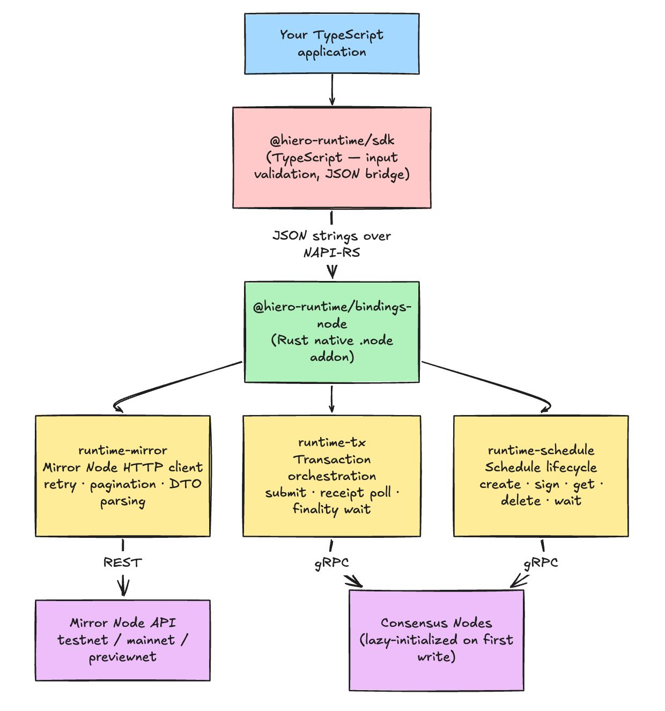
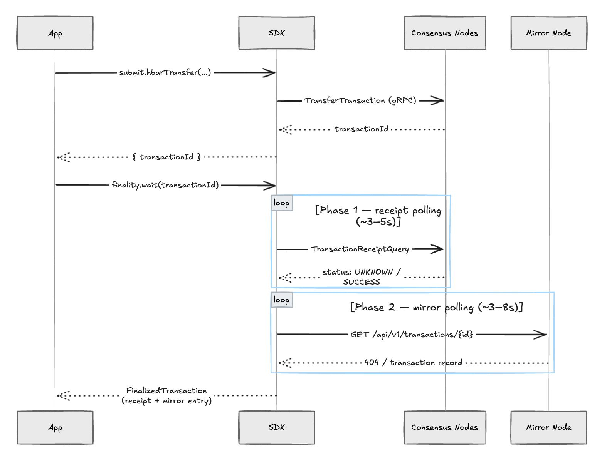
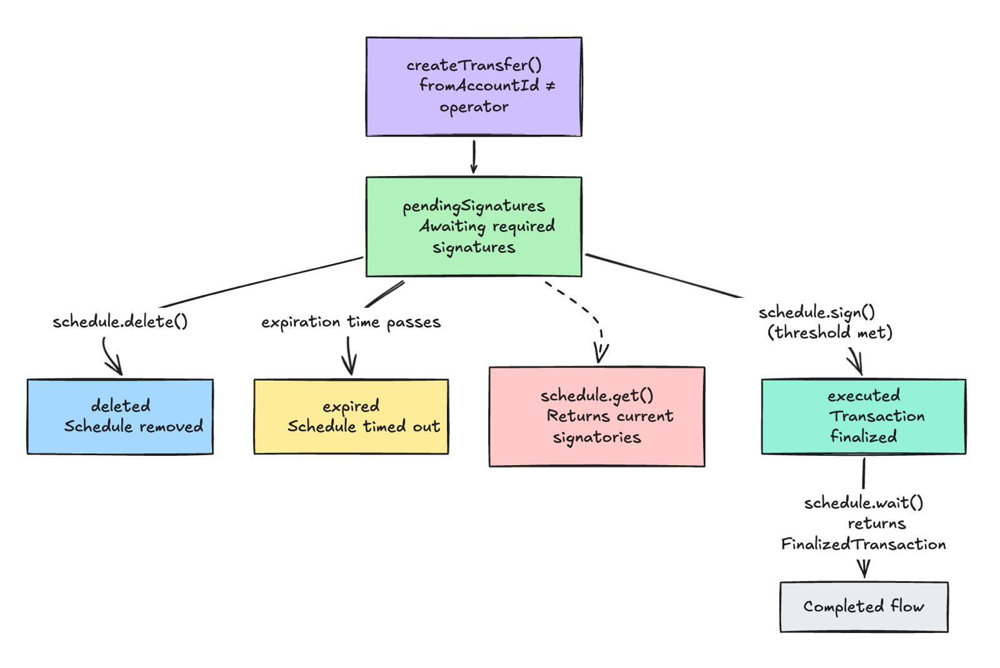

# Hiero Runtime SDK

**Hiero Runtime** is a TypeScript SDK for building on [Hedera](https://hedera.com), backed by a Rust native core. It ships what the official SDKs don't: a first-class Mirror Node REST client, two-phase finality tracking, and a complete scheduled-transaction lifecycle — all wrapped in a fully-typed TypeScript API.

The SDK is structured as a thin TypeScript layer over a compiled Rust addon (via [NAPI-RS](https://napi.rs)). Mirror Node queries, retry logic, finality polling, and schedule state management all run in Rust. The public API you write against is pure TypeScript.

## Live Testnet Transactions

These were submitted through this SDK against Hedera testnet, no other tools:

`HBAR transfer — two-phase finality in 4.0s:` [0.0.8345047@1774278205.364524314](https://hashscan.io/testnet/transaction/0.0.8345047-1774278205-364524314)

`Scheduled transfer — pendingSignatures → executed:` [Schedule 0.0.8345509](https://hashscan.io/testnet/schedule/0.0.8345509)

`Sender account (0.0.8345047):` [hashscan.io/testnet/account/0.0.8345047](https://hashscan.io/testnet/account/0.0.8345047)

`Example 5 - Crypto Transfer:` [hashscan.io/testnet/transaction/1774293356.141678447](https://hashscan.io/testnet/transaction/1774293356.141678447)

`Example 5 - Receipt Only Tx:` [hashscan.io/testnet/transaction/1774293360.942403917](https://hashscan.io/testnet/transaction/1774293360.942403917)

`Example 6 - Schedule Created:` [hashscan.io/testnet/transaction/1774293390.514946747](https://hashscan.io/testnet/transaction/1774293390.514946747)

`Example 6 - Schedule Sign:` [hashscan.io/testnet/transaction/1774293395.234992683](https://hashscan.io/testnet/transaction/1774293395.234992683)


## Table of Contents

<ol>
  <li><a href="#1-what-this-is">What this is</a></li>
  <li><a href="#2-what-the-other-sdks-dont-do">What the other SDKs don't do</a></li>
  <li><a href="#3-architecture">Architecture</a>
    <ul>
      <li><a href="#31-system-overview">System overview</a></li>
      <li><a href="#32-module-map">Module map</a></li>
    </ul>
  </li>
  <li><a href="#4-core-concepts">Core concepts</a>
    <ul>
      <li><a href="#41-two-phase-finality">Two-phase finality</a></li>
      <li><a href="#42-mirror-node-client">Mirror Node client</a></li>
      <li><a href="#43-pagination">Pagination</a></li>
      <li><a href="#44-scheduled-transfers">Scheduled transfers</a></li>
      <li><a href="#45-structured-errors">Structured errors</a></li>
    </ul>
  </li>
  <li><a href="#5-getting-started">Getting started</a></li>
  <li><a href="#6-examples">Examples</a></li>
  <li><a href="#7-api-reference">API reference</a></li>
  <li><a href="#8-benchmarks">Benchmarks</a></li>
  <li><a href="#9-configuration">Configuration</a></li>
  <li><a href="#10-error-codes">Error codes</a></li>
  <li><a href="#11-roadmap">Roadmap</a></li>
  <li><a href="#12-contributing">Contributing</a></li>
  <li><a href="#13-license">License</a></li>
</ol>

---

## 1. What this is

Hedera is a layer-1 distributed ledger with two distinct layers that any real application needs to work with. The **consensus layer** (gRPC) is where transactions land and get confirmed. The **Mirror Node** (REST API at `https://{network}.mirrornode.hedera.com/api/v1/`) is where you read everything back: account balances, transaction history, token holdings, contract results. Every block explorer, every wallet, every analytics tool reads from the Mirror Node.

The official SDKs only talk to the consensus layer. This SDK talks to both.

Beyond reads, the SDK adds two higher-level patterns that have no equivalent in the official tooling:

**Two-phase finality** — a single `await` that covers consensus confirmation *and* Mirror Node visibility. When it resolves, your transaction is observable by anyone on the network, not just internally confirmed.

**Schedule lifecycle management** — create a scheduled HBAR transfer, track its signature collection status, co-sign it from a separate key, and wait for execution to complete — all through one coherent API. Scheduled transactions are Hedera's native mechanism for trustless multi-party authorization: signers never share private keys; the schedule lives on-chain and accumulates signatures independently.

---

## 2. What the other SDKs don't do

The Hedera ecosystem has two official SDKs. **`@hashgraph/sdk`** is the JavaScript SDK — it handles transaction submission and receipt polling, but has zero Mirror Node integration and no structured error types. **`hiero-sdk-rust`** is the Rust SDK — also consensus-only, and it has no Node.js bindings, so you can't use it from JavaScript at all.

| | `@hashgraph/sdk` | `hiero-sdk-rust` | **This SDK** |
|---|:---:|:---:|:---:|
| Mirror Node — account lookup | — | — | ✅ |
| Mirror Node — transaction lookup | — | — | ✅ |
| Mirror Node — contract results | — | — | ✅ |
| Paginated transaction history | — | — | ✅ |
| Async generator pagination | — | — | ✅ |
| Two-phase finality (receipt + mirror) | — | — | ✅ |
| Schedule lifecycle (create/sign/wait/delete) | Partial | — | ✅ |
| Typed structured errors | — | — | ✅ |
| Retry with exponential back-off + jitter | Partial | Partial | ✅ |
| Node.js bindings | ✅ | — | ✅ |
| Custom network support | ✅ | ✅ | ✅ |
| HBAR transfer | ✅ | ✅ | ✅ |
| HTS tokens | ✅ | ✅ | Roadmap |
| Smart contract deployment | ✅ | ✅ | Roadmap |
| HCS topic messages | ✅ | ✅ | Roadmap |

`@hashgraph/sdk` exposes `ScheduleCreateTransaction` but provides no lifecycle helpers — no status polling, no `wait()`, no sign-and-track. You'd need to build all of that yourself.

---

## 3. Architecture

### 3.1 System overview



The TypeScript layer handles input validation and serializes every call to JSON before passing it across the NAPI-RS boundary into Rust. Rust deserializes, runs the operation on a Tokio async runtime, serializes the result back to JSON, and returns it. The round-trip cost at P50 is about 3ms — negligible for any real workload.

The consensus SDK client (which opens gRPC connections and loads TLS certificates) is **lazily initialized** — `createClient()` is instant. The Hiero SDK only bootstraps on your first write or receipt query. Mirror Node reads never pay that cost.

### 3.2 Module map

| Crate | Responsibility |
|---|---|
| `runtime-core` | Shared types, error taxonomy, retry policy, `TransactionRef` ID parsing |
| `runtime-mirror` | Mirror Node HTTP client — get account, get transaction, list transactions with cursor pagination |
| `runtime-tx` | Submit HBAR transfer, poll for consensus receipt, wait for two-phase finality |
| `runtime-schedule` | Full schedule lifecycle — create scheduled transfer, sign, get info, delete, wait for execution |
| `bindings-node` | NAPI-RS binding that exposes all runtime operations as async Node.js functions |
| `packages/sdk` | TypeScript SDK — `createClient`, validation, JSON bridge, exported types |

---

## 4. Core concepts

### 4.1 Two-phase finality

When you submit a transaction on Hedera, two things happen in sequence. First, the consensus nodes agree on the transaction and issue a **receipt** — this takes about 3–5 seconds and confirms the transaction is valid and ordered. Second, the transaction propagates to the **Mirror Node**, the public REST API that every explorer, wallet, and analytics tool reads from — this takes another 3–8 seconds.

A transaction that has consensus but hasn't reached the Mirror Node is invisible to the outside world. `finality.wait()` covers both phases in one call:



At the point `finality.wait()` resolves, the transaction is publicly visible — anyone querying HashScan or the Mirror Node directly will see it.

### 4.2 Mirror Node client

```typescript
// No operator credentials needed — Mirror Node is public
const client = await createClient({ network: "testnet" });

// Account lookup — accepts account ID, EVM address, or alias
const account = await client.mirror.accounts.get("0.0.98");
// { account: "0.0.98", balance: "27593817...", evmAddress: "0x...0062", deleted: false }

// Transaction lookup — accepts @ format or dash format
const tx = await client.mirror.transactions.get("0.0.8345047-1774278205-364524314");
// { primary: { result: "SUCCESS", name: "CRYPTOTRANSFER", ... }, duplicates: [] }

// Contract execution result
const result = await client.mirror.contracts.getResult("0.0.12345-...");
// { result: "0x...", errorMessage: null }
```

### 4.3 Pagination

The Mirror Node returns results in pages. Two helpers are available depending on whether you want control or convenience.

**Manual cursor control** — you decide when to fetch the next page:

```typescript
const page1 = await client.mirror.transactions.list("0.0.8345047", { limit: 25 });
// { items: [...], nextCursor: "/api/v1/transactions?..." }

const page2 = await client.mirror.transactions.list("0.0.8345047", {
  cursor: page1.nextCursor,
});
```

**Async generator** — walks all pages automatically, one at a time, and stops the moment you `break`:

```typescript
for await (const page of client.mirror.transactions.pages("0.0.8345047")) {
  const match = page.find(tx => tx.result !== "SUCCESS");
  if (match) {
    console.log("First non-success tx:", match.transactionId);
    break; // no extra network request is made
  }
}
```

Each page request takes ~250–350ms on testnet. Early `break` costs zero additional requests.

### 4.4 Scheduled transfers

Scheduled transactions are one of Hedera's most underused primitives. They let two parties authorize a future transfer without either one sharing their private key — the schedule lives on-chain and collects signatures independently from each signer.



When `fromAccountId` is the same as the operator, the schedule auto-executes immediately on creation (operator signature already present). When `fromAccountId` is a different account, the schedule starts in `pendingSignatures` and waits for their key:

```typescript
// Party A creates and pays the fee
const created = await client.schedule.createTransfer({
  fromAccountId: "0.0.8345301",   // Party B sends the HBAR
  toAccountId:   "0.0.98",
  amountTinybar: "500000",
  payerAccountId: "0.0.8345047",  // Party A pays the schedule creation fee
});
// created.status === "pendingSignatures"
// created.scheduleId === "0.0.8345509"

// Party B signs from their own system — no key sharing
const updated = await client.schedule.sign({
  scheduleId: created.scheduleId,
  signerPrivateKey: partyBKey,
});
// updated.status === "executed"
// updated.signatories.length === 2

// Wait for full two-phase finality on the inner transaction
const execution = await client.schedule.wait(created.scheduleId);
// execution.finalized.receipt.status === "SUCCESS"
```

This exact flow was run live on testnet — [Schedule 0.0.8345509](https://hashscan.io/testnet/schedule/0.0.8345509) went from `pendingSignatures` to `executed` with two signatories, confirmed `SUCCESS`.

### 4.5 Structured errors

Every failure throws a `HieroRuntimeError` with a stable `code`, a `retryable` boolean, and a structured `details` object. No string-matching, no instanceof-then-regex:

```typescript
import { HieroRuntimeError } from "@hiero-runtime/sdk";

try {
  await client.mirror.accounts.get("0.0.99999999999");
} catch (err) {
  if (err instanceof HieroRuntimeError) {
    switch (err.code) {
      case "NOT_FOUND":    // account doesn't exist
      case "RATE_LIMITED": // back off, err.retryable === true
      case "TIMEOUT":      // finality or receipt timed out
      case "CONSENSUS":    // transaction rejected by consensus node
    }
  }
}
```

---

## 5. Getting started

### Prerequisites

- Node.js ≥ 20
- Rust toolchain (stable) — for building the native addon
- pnpm ≥ 10

### Build from source

```bash
git clone https://github.com/WhiteFlash14/Hiero-runtime-sdk.git
cd Hiero-runtime-sdk
pnpm install
pnpm build
```

`pnpm build` compiles the Rust workspace to a `.node` binary and runs `tsc` on the SDK. First build takes 60–90 seconds; subsequent builds are much faster.

### Getting testnet credentials

Go to [portal.hedera.com](https://portal.hedera.com), create an account, and generate a testnet account. You get a free account ID and 1,000 test HBAR instantly — no payment info required.

The portal generates **ECDSA secp256k1** keys by default. Your raw private key (64 hex chars) needs the DER prefix before passing it to the SDK:

```bash
# Raw key from portal:
# f86c...

# DER-encoded (prefix + key):
export HEDERA_OPERATOR_ID=0.0.12345
export HEDERA_OPERATOR_KEY=3030020100300706052b8104000a04220420f86c...
```

If your account uses an ED25519 key (older portal accounts), the prefix is `302e020100300506032b657004220420` instead.

### Network selection

All examples default to **testnet**. To switch networks, set `HEDERA_NETWORK` before running:

```bash
# testnet (default — free test HBAR, no real money)
export HEDERA_NETWORK=testnet

# mainnet (real HBAR)
export HEDERA_NETWORK=mainnet

# previewnet (early access features, occasionally unstable)
export HEDERA_NETWORK=previewnet
```

The env var is read by every example and by the SDK itself. No code changes needed to switch networks.

### Quick start — no credentials needed

```bash
node packages/sdk/examples/01-account-lookup.mjs

# Or on mainnet:
HEDERA_NETWORK=mainnet node packages/sdk/examples/01-account-lookup.mjs
```

This queries the Hedera treasury account and prints its live balance:

```
  Account:  0.0.98
  Balance:  27,593,817.05598657 HBAR
  EVM addr: 0x0000000000000000000000000000000000000062
```

---

## 6. Examples

All examples live in [`packages/sdk/examples/`](packages/sdk/examples/) and run against real testnet.

| # | File | Credentials | What it covers |
|---|---|:---:|---|
| 01 | [account-lookup.mjs](packages/sdk/examples/01-account-lookup.mjs) | None | Account queries by ID or EVM address; `NOT_FOUND` and `INVALID_CONFIG` error handling |
| 02 | [transaction-history.mjs](packages/sdk/examples/02-transaction-history.mjs) | None | Manual cursor pagination with `list()`; async generator with `pages()` |
| 03 | [transaction-lookup.mjs](packages/sdk/examples/03-transaction-lookup.mjs) | None | Single transaction lookup; `?scheduled` suffix; primary vs duplicate record selection |
| 04 | [error-handling.mjs](packages/sdk/examples/04-error-handling.mjs) | None | All 11 error codes; `retryable` flag; custom retry and finality config |
| 05 | [hbar-transfer.mjs](packages/sdk/examples/05-hbar-transfer.mjs) | Required | HBAR transfer; `finality.wait()`; `waitForReceipt()`; `client.attach()` |
| 06 | [scheduled-transfer.mjs](packages/sdk/examples/06-scheduled-transfer.mjs) | Required | Full schedule lifecycle; single-sig auto-execute; real multi-sig with `sign()`; `delete()` |
| 07 | [all-networks.mjs](packages/sdk/examples/07-all-networks.mjs) | None | Testnet, mainnet, previewnet queried in parallel; custom network config |
| — | [benchmark.mjs](packages/sdk/examples/benchmark.mjs) | None | P50/P95/P99 latencies; sequential vs parallel speedup; SDK overhead vs raw `fetch()` |

Running with credentials:

```bash
# Set once, then run any example
export HEDERA_NETWORK=testnet
export HEDERA_OPERATOR_ID=0.0.12345
export HEDERA_OPERATOR_KEY=3030020100300706052b8104000a04220420<your-64-char-key>

# HBAR transfer
node packages/sdk/examples/05-hbar-transfer.mjs

# Scheduled transfer — single-sig (auto-executes immediately)
node packages/sdk/examples/06-scheduled-transfer.mjs

# Scheduled transfer — real multi-sig (pendingSignatures → sign → executed)
export HEDERA_SECOND_SIGNER_ACCOUNT_ID=0.0.67890
export HEDERA_SECOND_SIGNER_KEY=3030020100300706052b8104000a04220420<second-key>
node packages/sdk/examples/06-scheduled-transfer.mjs
```

Switch to mainnet by setting `HEDERA_NETWORK=mainnet` — everything else stays the same.

---

## 7. API reference

### `createClient(options)` → `HieroRuntimeClient`

Builds a new client. Mirror Node HTTP client is initialized immediately; the Hiero consensus gRPC client is lazy — it only bootstraps on your first write or receipt query.

```typescript
const client = await createClient({
  network: "testnet", // "mainnet" | "testnet" | "previewnet" | "custom"
  operator: { accountId: "0.0.12345", privateKey: "302e..." }, // required for writes
  retry: { maxAttempts: 8, initialDelayMs: 250, maxDelayMs: 3000, jitter: true },
  finality: { receiptTimeoutMs: 15000, mirrorTimeoutMs: 20000, pollIntervalMs: 500 },
});
```

### Mirror Node

```typescript
client.mirror.accounts.get(id)                           // → MirrorAccountView
client.mirror.transactions.get(transactionId)            // → TransactionLookup
client.mirror.transactions.list(accountId, options?)     // → PageResult<MirrorTransactionRecord>
client.mirror.transactions.pages(accountId, options?)    // → AsyncGenerator<MirrorTransactionRecord[]>
client.mirror.contracts.getResult(txIdOrHash, nonce?)    // → ContractResultView
```

`transactions.get()` accepts both the `@` format from the SDK (`0.0.X@seconds.nanos`) and the dash format from Mirror Node responses (`0.0.X-seconds-nanos`). The `?scheduled` and `?nonce=N` suffixes are also supported.

### Write operations

```typescript
client.submit.hbarTransfer({ fromAccountId, toAccountId, amountTinybar })
// → { transactionId }

client.finality.wait(transactionId)           // receipt + mirror → FinalizedTransaction
client.finality.waitForReceipt(transactionId) // consensus only → ReceiptResult

client.attach(transactionId)                  // → { waitForFinality, waitForReceipt }
// use this when you have a tx ID from another system and don't need to resubmit
```

### Schedule lifecycle

```typescript
client.schedule.createTransfer({ fromAccountId, toAccountId, amountTinybar, payerAccountId?, memo? })
// → { scheduleId, scheduledTransactionId, status }

client.schedule.get(scheduleId)
// → { scheduleId, status, creatorAccountId, signatories, expirationTime, executedTimestamp? }

client.schedule.sign({ scheduleId, signerPrivateKey })
// → ScheduleInfoView (updated signatories + status)

client.schedule.wait(scheduleId)
// → { scheduleId, scheduledTransactionId, finalized: FinalizedTransaction }

client.schedule.delete({ scheduleId })
// → void
```

---

## 8. Benchmarks

Measured against live Hedera testnet Mirror Node:

```
Single account query — 20 runs
  P50: 19ms   P95: 22ms   P99: 22ms   Max: 92ms

Sequential vs parallel — 8 accounts
  Sequential:  9,960ms    Parallel: 543ms    Speedup: 18.4×

Pagination — 5 pages × 25 transactions
  Total: ~1,500ms    Per page: ~300ms

SDK overhead vs raw fetch() — P50
  fetch: 17ms    SDK: 20ms    Delta: +3ms
```

The 18.4× parallel speedup shows the Tokio async runtime correctly releases the event loop between requests. The +3ms P50 overhead is the cost of the Rust/JS JSON bridge — in practice unnoticeable.

---

## 9. Configuration

### Custom network

```typescript
const client = await createClient({
  network: "custom",
  mirror: { baseUrl: "https://mirror.my-network.example.com" },
  consensusNodes: [
    { url: "34.94.106.61:50211", accountId: "0.0.3" },
    { url: "35.237.119.55:50211", accountId: "0.0.4" },
  ],
  operator: { accountId: "0.0.1001", privateKey: "302e..." },
});
```

For `"mainnet"`, `"testnet"`, and `"previewnet"`, Mirror Node URLs and consensus node addresses are pre-configured. You can still override `mirror.baseUrl` if you run your own mirror.

### Retry and finality

The retry policy controls back-off for `RATE_LIMITED`, `TRANSPORT`, and retryable `CONSENSUS` errors. The finality policy controls how long `wait()` and `waitForReceipt()` poll before giving up.

```typescript
{
  retry: {
    maxAttempts: 8,      // includes the first attempt
    initialDelayMs: 250,
    maxDelayMs: 3000,
    jitter: true,        // ±30% random jitter to spread retries
  },
  finality: {
    receiptTimeoutMs: 15000,
    mirrorTimeoutMs:  20000,
    pollIntervalMs:   500,
  }
}
```

---

## 10. Error codes

| Code | Retryable | When it appears |
|---|:---:|---|
| `INVALID_CONFIG` | No | Missing field, empty string, or bad input at the call site |
| `NOT_FOUND` | No | Account or transaction does not exist on the network |
| `TIMEOUT` | — | Receipt or Mirror poll exceeded the configured timeout |
| `TRANSPORT` | Yes | Network-level failure — DNS, TCP, or TLS |
| `RATE_LIMITED` | Yes | Mirror Node returned HTTP 429 |
| `MIRROR_HTTP` | Partially | Non-200 from Mirror Node (5xx retries, 4xx does not) |
| `CONSENSUS` | Partially | Consensus node rejected the transaction |
| `SCHEDULE` | No | Schedule expired, deleted, or already executed |
| `SERIALIZATION` | No | Mirror Node returned an unexpected response shape |
| `UNSUPPORTED` | No | Feature unavailable for the selected network |
| `INTERNAL` | No | Unexpected error inside the SDK |

---

## 11. Roadmap

The current scope covers accounts, HBAR transfers, scheduled transfers, and Mirror Node history. Planned additions:

- **HTS** — fungible token creation, minting, transfer; NFT collections; token association
- **HCS** — topic creation, message submission, Mirror Node subscription for topic messages
- **Smart contracts** — deployment from bytecode, `ContractExecuteTransaction`, ABI helpers
- **npm publishing** — prebuilt `.node` binaries for Linux x64, macOS arm64, macOS x64, and Windows x64 so users can `npm install @hiero-runtime/sdk` without a Rust toolchain

---

## 12. Contributing

See [CONTRIBUTING.md](CONTRIBUTING.md) for the full process. The short version: fork, branch from `main`, write tests for what you add, sign your commits (DCO), and open a PR.

```bash
# Run everything before pushing
cargo test --workspace
cd packages/sdk && pnpm test
pnpm -r typecheck
```

Commit messages follow [Conventional Commits](https://www.conventionalcommits.org/). GPG signing is required.

---

## 13. License

Apache License 2.0 — see [LICENSE](LICENSE).
